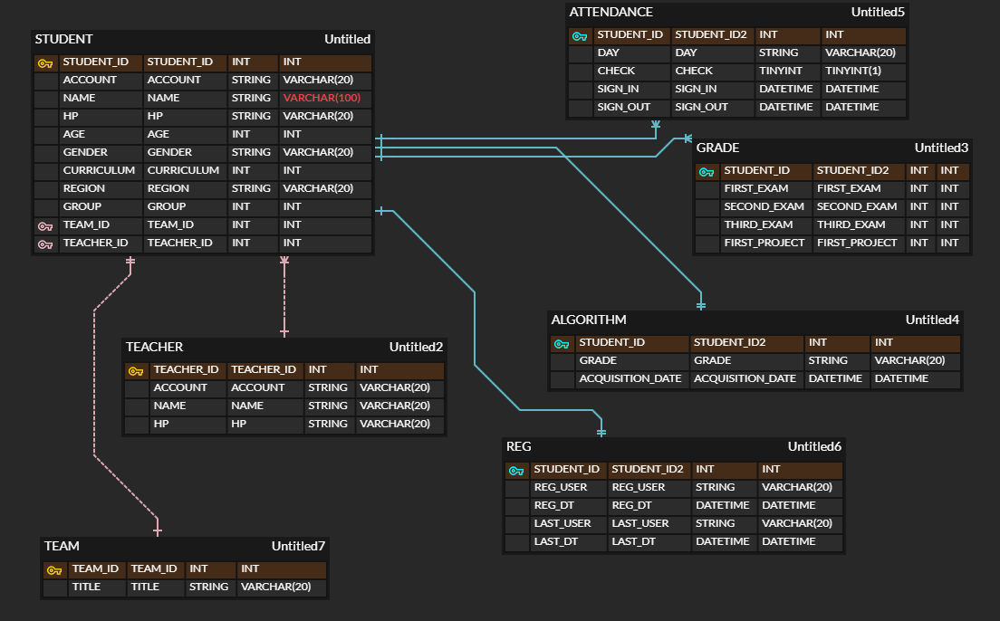

## ERD_DIAGRAM

먼저 테이블을 어떻게 분리해야 할까 생각했습니다.

STUDENT, TEACHER 테이블들을 나눴고 교사는 여러명의 학생들을 가질 수 있기 때문에 교사 1 : 학생 N 관계를 맺어주었습니다.

2학기에는 프로젝트를 수행하기 때문에, PROJECT 테이블을 따로 만들고 팀 번호와 주제를 컬럼으로 생성하였습니다. 팀과 학생 사이는 1:1 관계라고 생각하였습니다.

ATTENDANCE, GRADE, ALGORITHM, REG 에는 모두 STUDENT_ID 가 PK 면서 FK가 되도록 구성하였습니다. 주제나 기능별로 나누는 것이 좋을 것 같아 이렇게 분리하였습니다.

## DB_SCHEMA
[DB_SCHEMA 파일 바로가기](https://github.com/heeseonim/DB_Normalization/blob/master/DB_Schema.sql)

ERD_DIAGRAM 에 표시한대로 sql 문을 작성하여 보았습니다.
